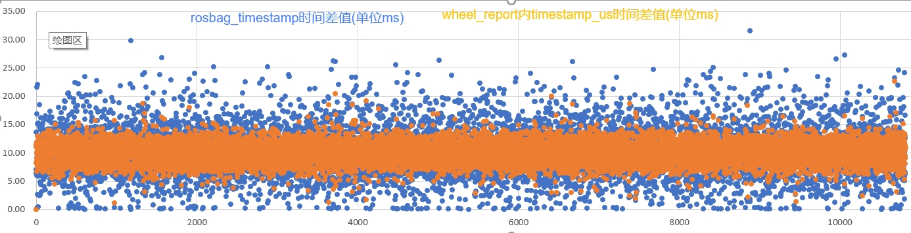
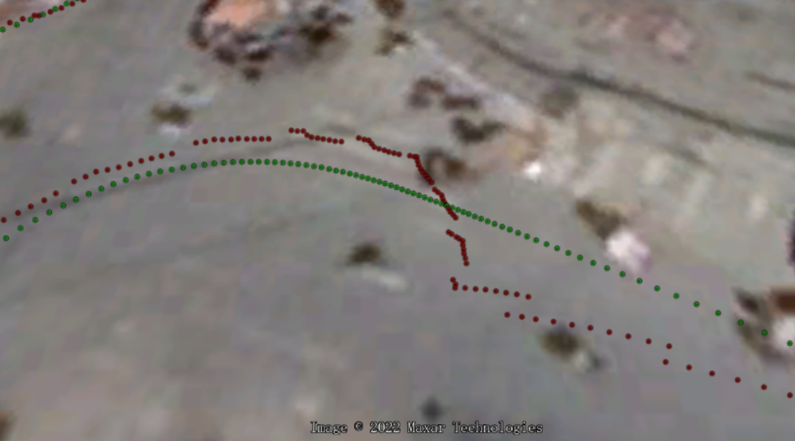
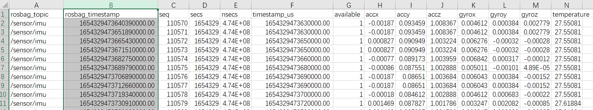

## 背景

嵌入式开发经常需要分析各类传感器的原始数据，分析信号的延迟、重复及正确性。rosbag在设备内直接回放，只适合实时信号分析，但不方便连续时间序列信号分析。

因此，将rosbag关注topic直接转换为csv，就可以直接用第三方工具分析。比如，用excel输出信号图形、用google earth显示轨迹信号。

如果在ROS环境内，可以使用以下命令转换为csv:

```sh
rostopic echo -b [bag_name].bag -p [topic_name] > [csv_name].csv
```

更多时候，通过数采来的rosbag，在PC端也需要快速转换以方便分析。需要一个满足上述需求的rosbag2csv脚本，将bag包中任意关注的topic自动转换为csv（无需预知msg定义）。

## 实现列表

- [X] 自动解析任意Topic(无需预知msg定义)
- [X] 支持多个Topic输入解析
- [X] 支持多个文件同时输入解析 
- [ ] JSON型字符串信息2次解析

## 首次下载

```
# 克隆工程
git clone https://github.com/x-roocky/rosbag2csv.git

# 进入目录
cd rosbag2csv

# 安装全部依赖第三方库
pip3 install -r requirements.txt
```

## 开始使用

```sh

# 使用方法
python3 rosbag2csv.py [topic1_name, topic2_name, ...] "bag_name1.bag" "bag_name2.bag" ...

# 示例1：单Topic/单bag包
python3 rosbag2csv.py "/sensor/gnss_rtk" ./x.bag

# 示例2：单Topic/多bag包
python3 rosbag2csv.py "/sensor/gnss_rtk" ./xx/x1.bag ./xx/x2.bag ./xx/x3.bag

# 示例3：多Topic(逗号分割)/模糊匹配bag包
python3 rosbag2csv.py "/sensor/gnss_rtk, /sensor/gnss_rtk_tbox" ./xx/*.bag

```

## csv使用分析示例

数值信号导入Excel分析图形分析：


轨迹导入Google Earth分析：


直接在导入Excel观察数据结果：


